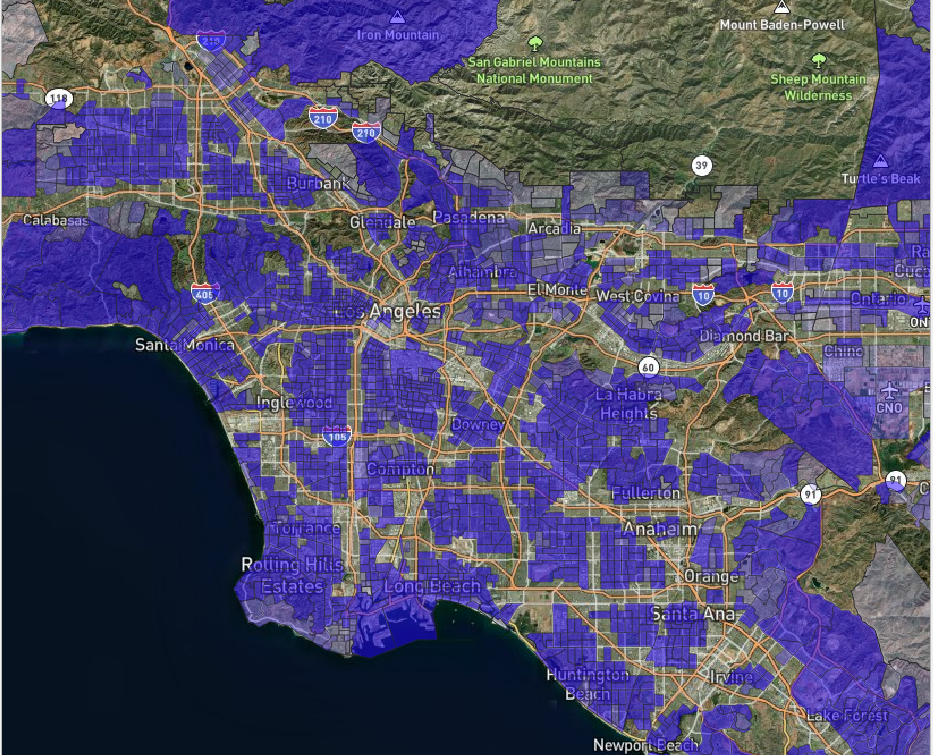

# GEOG 458 - Lab 4
Isabella Vazquez

Data Attribution: https://oehha.ca.gov/calenviroscreen/report/calenviroscreen-40 

Traffic Variable - Percentile of Traffic density, in vehicle-kilometers per hour per road length, within 150 meters of the census tract boundary

## Map URL

[Web Map](https://isabellavaz.github.io/geog458-maptiles/)

## Basemap

Geographic Area: Los Angeles, CA
Available Zoom Levels: 1-13

## Highways

Geographic Area: Los Angeles, CA
Available Zoom Levels: 1-13

## Traffic

Geographic Area: Los Angeles, CA
Available Zoom Levels: 1-13

## Satellite View

The satellite view with bright red indicating the highway system offers the viewer a glimpse of scenery and an 
understanding of the stark differences. 
Geographic Area: Los Angeles, CA
Available Zoom Levels: 1-13

---

API REFERENCE: mapbox gl css
lab 4 created by Professor Zhao. Link: https://github.com/jakobzhao/geog458/tree/master/labs/lab04
