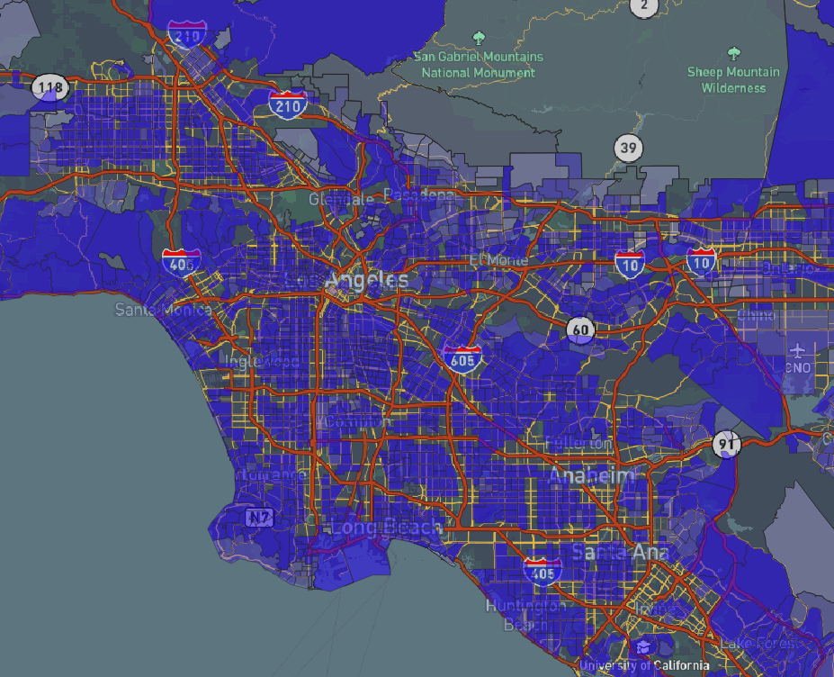

# GEOG 458 - Lab 4
Isabella Vazquez

Data Attribution: https://oehha.ca.gov/calenviroscreen/report/calenviroscreen-40 

Traffic Variable - Percentile of Traffic density, in vehicle-kilometers per hour per road length, within 150 meters of the census tract boundary

## Map URL

[Web Map]()

## Basemap

## Highways

## Traffic

## Satellite View

The satellite view with bright red indicating the highway system offers the viewer a glimpse of scenery and an 
understanding of the stark differences. 

---

API REFERENCE: mapbox gl css
lab 4 created by Professor Zhao. Link: https://github.com/jakobzhao/geog458/tree/master/labs/lab04